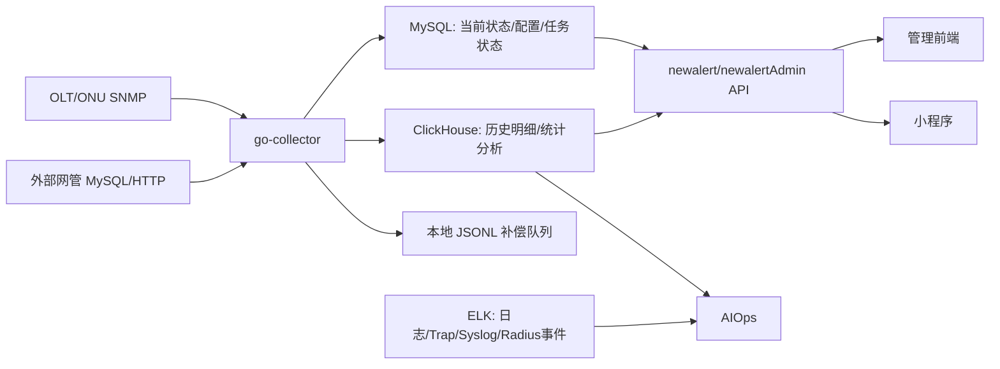

# SNMP ONU/OLT 采集系统后续开发思路

更新日期：`2026-06-26`

## 1. 结论先行

当前 Go 采集项目的下一阶段目标，不是一次性重做成大数据平台，而是先把“采集、当前查询、短期趋势、每日统计、质差清单”这条主链路做成稳定产品。

建议采用三阶段路线：

| 阶段 | 核心目标 | 主要产出 |
| --- | --- | --- |
| 第一阶段 | 稳住现有采集和查询闭环 | 本地 ONU 高频光功率稳定、慢设备隔离、流量每日化、外部 ONU 写入错峰、MAC 查询 API、质差清单雏形 |
| 第二阶段 | 建立数据分层和统计能力 | 当前状态、短期历史、每日特征、每日流量、质差清单、PON/OLT/区域统计表和页面 |
| 第三阶段 | 引入 ClickHouse/事件平台扩展 | SNMP 历史长周期查询、Radius/抓包事件分析、AIOps 关联分析 |

当前最优先的开发顺序：

1. 继续稳定 `go-collector` 本地 ONU 光功率采集，保持 60 分钟频率，极慢设备继续隔离或降频。
2. 把 IF/octet 流量从“每小时全量采”正式转为“每日固定窗口采集 + 每日流量结果”，避免拖垮主体采集。
3. 外部 ONU 同步继续保留，但要解决每小时二十多万行写 MySQL 的压力：先错峰和限流，再评估是否只更新 latest、降低 history 写入频率，最后再迁移历史明细到 ClickHouse。
4. 后端先提供面向前端/小程序的查询 API：按 ONU MAC 查当前状态、光功率趋势、每日流量、质差记录。
5. ClickHouse 建议先做单节点试运行，用于长周期历史和统计查询，不建议第一步就上集群或 Kafka。

## 2. 当前运行判断

截至 `2026-06-26` 的运行观察：

| 模块 | 当前状态 | 判断 |
| --- | --- | --- |
| collector 主进程 | 单实例稳定运行 | 基础运行形态可继续沿用 |
| 本地 ONU 采集 | 主体队列已不堵，慢设备仍存在 | 慢设备隔离有效，但 40/51/52/137 等设备需要长期独立策略 |
| ONU 光功率 | 仍应保持高频 | 这是用户体验和故障诊断的核心数据 |
| IF/octet 流量 | 已改为每日固定窗口 | 方向正确，不应再混在每小时 ONU 主链路里全量采 |
| 外部 ONU 同步 | 拉取快，写入慢 | 当前主要压力是大批量写 `olt_onu_his/last` |
| MySQL | 适合作当前状态和业务库 | 不适合继续承担无限历史和高并发分析查询 |
| summary_rollup | 当前关闭/不稳定 | 需要重构为轻量、可重跑、分片的每日任务 |
| CMTS local | 成功率低 | 暂不作为第一阶段主线 |
| Radius/抓包/AIOps | 需求明确但不是当前主战场 | 需要提前留数据平台接口，但不要影响 SNMP 主链路 |

关键判断：

- 现在的问题不是单纯“worker 不够”，而是采集频率、数据价值、写入方式、查询方式没有完全分层。
- MySQL 可以继续承载当前状态、配置、任务状态、短期明细和轻量统计，但不能再把所有 SNMP 历史、Radius 明细、抓包分析都压到 MySQL。
- ClickHouse 适合解决长周期历史查询和大批量分析，但它不替代 MySQL 的业务状态库。
- Kafka/Redpanda 对 SNMP 不是第一阶段刚需；对 Radius、抓包、多消费者事件流更有价值。

## 3. 功能目标拆解

### 3.1 ONU 当前状态查询

目标：输入 ONU MAC，快速查到它当前在哪台 OLT、哪个 PON 口、当前光功率、在线状态、最近采集时间，以及能关联到的业务资料。

当前已有基础：

- `olt_onu_last`：ONU 最新状态
- `olt_devices`：OLT 台账
- `olt_pon_business_info`：从业务资料表导入的 PON/光节点信息
- `v_onu_mac_business_info`：ONU MAC 到业务资料的关联视图

下一步应做：

| 事项 | 说明 |
| --- | --- |
| MAC 标准化 | API 入参兼容 `xxxx.xxxx.xxxx`、`xx:xx:xx:xx:xx:xx`、无分隔格式 |
| 当前状态 API | `/api/onu/{mac}/current` |
| 业务信息补全 | 展示机房、光节点、业务类型、开通日期、OLT 端口 |
| 数据新鲜度 | 标明 `query_time` 与当前时间差，避免用户误把旧数据当实时数据 |
| 异常标记 | 标明弱光、离线、无效光功率、外部数据、SNMP 自采数据来源 |

### 3.2 单 ONU 光功率趋势

目标：支持最近 12 小时、24 小时、7 天、15 天的光功率趋势查询。

建议数据策略：

| 时间范围 | 查询来源 | 说明 |
| --- | --- | --- |
| 12/24 小时 | 短期明细或小时聚合 | 用于排障，需要尽量接近采集粒度 |
| 7/15 天 | 小时聚合优先 | 页面趋势不需要每条原始记录 |
| 30 天以上 | 日特征表 | 看长期恶化趋势 |

第一阶段可以继续用 MySQL 的 `olt_onu_his` 或 `olt_onu_power_hourly`，但必须避免前端直接扫大历史表。

### 3.3 ONU 每日流量

目标：从“接口 octets 原始采集”转为“每个 ONU/端口每天用了多少流量”。

当前已改为每日固定窗口：

- `traffic_daily_window_enabled=true`
- `traffic_daily_window_start=00:05`
- `traffic_daily_window_end=01:30`
- 非窗口时段不再采 IF/octet

后续建议：

| 事项 | 说明 |
| --- | --- |
| 采集口径 | 每天固定窗口采一次 counter，按前后两天 counter delta 计算日流量 |
| 日界定 | 采用自然日 `00:00:00-23:59:59`，采集时间放在次日凌晨窗口 |
| 结果表 | 生成 `onu_traffic_daily` 或复用/扩展 `olt_if_rate_daily` |
| 异常处理 | counter 回绕、设备重启、时间间隔异常时标记质量码，不强行写 0 |
| 前端展示 | 默认展示每日上行、下行、总流量，不展示原始 octets |

注意：如果仅每天采一次 counter，严格意义上计算的是两个采集点之间的 delta，接近日自然日流量。要做到完全 `0-24` 精确口径，需要每日边界附近有稳定采样点，或者保留更高频的核心端口采样。

### 3.4 每日质差设备清单

目标：每天形成可查询、可导出的质差 ONU 清单。

建议质差清单不是临时查询 `olt_onu_last`，而是每天固化一张结果：

| 字段 | 说明 |
| --- | --- |
| `stat_date` | 统计日期 |
| `onu_mac` | ONU MAC |
| `olt_device_id` / `olt_name` | 所属 OLT |
| `pon_port` / `if_index` | 所属 PON 口或 ONU 端口 |
| `rx_power` / `tx_power` | 当日关键光功率值 |
| `quality_type` | 弱光、离线、无效值、突变、持续恶化等 |
| `quality_reason` | 规则解释 |
| `region` | 区域 |
| `business_info` | 账号/光节点/业务资料，能关联则填 |
| `last_query_time` | 当日最后采集时间 |

第一阶段先实现“按阈值判断弱光 + 每日导出”，后续再加入突变、PON 口批量异常、逐步恶化。

### 3.5 OLT 性能监测

当前配置已支持 `performance.interval_sec=300`，即 5 分钟采集。

建议继续保持：

| 数据 | 频率 | 保留方式 |
| --- | ---: | --- |
| OLT CPU/内存 | 5 分钟 | 明细 30-90 天，小时/日聚合长期 |
| 板卡 CPU/内存/温度 | 5 分钟 | 明细 30-90 天，小时/日聚合长期 |
| 接口状态 | 暂不与 CPU/内存强绑定 | 后续拆成独立端口画像任务 |

## 4. 数据分层设计

### 4.1 分层原则

| 层级 | 存什么 | 默认查询方 | 保留周期 |
| --- | --- | --- | --- |
| 当前状态层 | 每个 ONU/OLT/端口最新一条 | 前端、小程序、告警判断 | 永久覆盖更新 |
| 短期明细层 | 最近一段时间原始采样 | 排障 drill-down | 7-30 天 |
| 小时聚合层 | 每小时 min/max/avg/count | 趋势图 | 6-12 个月 |
| 每日结果层 | 每日特征、每日流量、质差清单 | 报表、导出、统计 | 2-5 年 |
| 事件分析层 | PON 异常、ONU 恶化、Radius/抓包事件 | AIOps、运维研判 | 1-3 年 |

### 4.2 MySQL 职责

MySQL 继续作为业务和运行态数据库：

- 设备台账：`olt_devices`、后续端口画像表
- 当前状态：`olt_onu_last`、`olt_octets_last`、`olt_perf_*_last`
- 任务状态：`collector_task_overview`、`collector_task_detail`
- 阈值规则、采集配置、厂商 OID 模板
- 短期历史和每日结果的过渡实现
- 前端/小程序高频点查数据

MySQL 不再承担：

- 长期全量原始 SNMP 明细
- Radius/抓包明细事件的长期分析
- 大范围历史趋势扫表查询

### 4.3 ClickHouse 职责

ClickHouse 建议先单节点试运行，定位为历史分析库：

- ONU 光功率长周期明细和聚合
- OLT 性能 5 分钟明细和聚合
- 每日质差清单、每日统计
- 后续 Radius/抓包结构化事件
- 大范围按时间、区域、OLT、PON 口的分析查询

第一阶段不建议直接上集群，原因：

- 当前 SNMP 采集规模单节点 ClickHouse 足够试运行。
- 项目还在梳理采集口径和数据模型，过早集群会放大运维复杂度。
- 先验证表模型、写入方式、查询收益，再决定副本和分片。

建议触发集群的条件：

| 条件 | 动作 |
| --- | --- |
| 单节点 CPU/IO 持续瓶颈 | 加第二节点或冷热分层 |
| 数据必须高可用，不能接受单节点故障 | 上 ReplicatedMergeTree + Keeper |
| Radius/抓包事件量远超 SNMP | 为事件链路单独规划 ClickHouse 集群 |
| 多系统同时重查询影响采集 | 拆读写或增加副本 |

### 4.4 ELK 职责

现有 ELK 继续用于：

- AIOps 日志检索
- Syslog、Trap、程序日志
- Radius/抓包文本化事件检索
- 故障现场关键字搜索

ELK 不建议作为 SNMP 数值趋势主库。数值趋势、长期聚合和大范围 group by 更适合 ClickHouse。

### 4.5 Kafka/Redpanda 判断

SNMP 采集是定时轮询，不是天然必须消息队列。第一阶段不建议引入 Kafka。

适合引入 Kafka/Redpanda 的场景：

- Radius/抓包事件持续实时进入，且有多个消费者。
- ClickHouse、ELK、AIOps 需要同时消费同一份事件。
- 下游不可用时，需要缓存和重放。
- 采集节点扩展到多台，写入链路需要解耦。

短期替代方案：

- Go collector 直接批量写 MySQL/ClickHouse。
- 写入失败时本地 JSONL 落盘，后台补偿。
- 对外部 ONU 大批量同步采用错峰、限流、分片写入。

## 5. 基于当前项目的数据结构升级方案

这一节是对当前 `go_collector` 库的落地改造建议。原则是不推倒重来，不把已经在线的表随意改名；先围绕现有表补齐当前查询、每日结果和长期分析需要。

### 5.1 当前表分组和去留

| 当前表 | 现状定位 | 后续处理 |
| --- | --- | --- |
| `olt_onu_last` | ONU 最新状态主表 | 保留，作为当前查询核心表；补 MAC 查询能力和 current 视图 |
| `olt_onu_his` | ONU 光功率/状态历史明细 | 保留短期，长期明细后续迁 ClickHouse；前端不直接查 |
| `olt_octets_last` | IF/octet 最新 counter | 保留，用于每日流量 delta 计算 |
| `olt_octets_his` | IF/octet 原始历史 | 降级为短期过渡表；稳定后尽量停写或只窗口写 |
| `olt_if_rate_his/hourly/daily` | 已有接口速率/聚合表 | 继续保留，但要明确端口分类和 ONU 日流量结果表关系 |
| `olt_onu_power_hourly/daily` | 已有光功率聚合表 | 保留，作为趋势查询主来源；补足每日特征口径 |
| `olt_onu_quality_event` | 质差状态变化事件 | 保留，用于 enter/recover 事件；不能替代每日质差清单 |
| `olt_pon_business_info` | PON/光节点业务资料 | 保留；增加导入批次、当前有效标记和数据质量字段 |
| `v_onu_mac_business_info` | ONU MAC 业务关联视图 | 保留；后续升级为 API 查询的基础视图之一 |
| `olt_port_profile` | 端口画像表 | 保留；补 PON/ONU 端口归类、展示名、父子关系 |
| `collector_task_overview/detail` | 任务运行状态 | 保留；补充运行耗时、滞后、心跳和来源状态口径 |
| `cmts_*` | CMTS 采集链路 | 暂缓深改，按同样分层原则后续处理 |

第一阶段不要再新建一个完全替代 `olt_onu_last` 的 `onu_current` 实表。更合理的是保留 `olt_onu_last`，新增面向查询的视图或 API DTO，避免双写和一致性问题。

### 5.2 ONU 当前查询层升级

当前目标是让 MAC 查询稳定、快、字段完整。

建议新增或调整：

```sql
-- 1. 为 MAC 点查恢复一个轻量索引。
-- 之前为了降低 hot write 压力清理过部分复合索引，但 MAC 查询已成为核心功能。
-- 如果 mac_address 存在格式不统一问题，先在代码写入侧统一标准化，再建索引。
ALTER TABLE olt_onu_last
  ADD INDEX idx_onu_last_mac (mac_address);

-- 2. 建议新增当前查询视图，统一前端/API 字段，减少页面直接理解底层表。
CREATE OR REPLACE VIEW v_onu_current AS
SELECT
  l.mac_address AS onu_mac,
  l.olt_device_id,
  d.name AS olt_name,
  d.primary_ip AS olt_primary_ip,
  d.backup_ip AS olt_backup_ip,
  l.region,
  l.external_database,
  CASE WHEN l.external_database IS NULL OR l.external_database = '' THEN 'local_snmp' ELSE 'external_sync' END AS data_source,
  l.if_index,
  l.port_if_index,
  l.uplink_port,
  l.rx_power,
  l.tx_power,
  l.status,
  l.quality_bad,
  l.quality_code,
  l.quality_rule_version,
  l.query_time,
  TIMESTAMPDIFF(SECOND, l.query_time, NOW()) AS data_age_sec
FROM olt_onu_last l
LEFT JOIN olt_devices d ON d.olt_device_id = l.olt_device_id;
```

后续如果发现 `mac_address` 格式历史上不统一，再加 `mac_norm` 字段或生成列，而不是让 API 每次做复杂条件：

```sql
ALTER TABLE olt_onu_last
  ADD COLUMN mac_norm VARCHAR(20) NULL AFTER mac_address,
  ADD INDEX idx_onu_last_mac_norm (mac_norm);
```

对应代码改造：

- 所有 ONU 写入路径统一输出 `mac_norm`。
- API 入参统一标准化后查 `mac_norm`。
- `olt_onu_his`、`olt_onu_quality_event`、ClickHouse 明细表也使用同一标准。

### 5.3 业务资料导入结构升级

当前已有 `olt_pon_business_info` 和 `v_onu_mac_business_info`，但它更像一次导入结果。后续需要支持重复导入、校验、回溯和当前有效版本。

建议新增导入批次表：

```sql
CREATE TABLE IF NOT EXISTS data_import_batch (
  id BIGINT UNSIGNED NOT NULL AUTO_INCREMENT PRIMARY KEY,
  import_type VARCHAR(64) NOT NULL,
  source_file VARCHAR(255) NOT NULL,
  row_count INT NOT NULL DEFAULT 0,
  valid_count INT NOT NULL DEFAULT 0,
  invalid_count INT NOT NULL DEFAULT 0,
  imported_by VARCHAR(64) NULL,
  imported_at TIMESTAMP NOT NULL DEFAULT CURRENT_TIMESTAMP,
  note VARCHAR(255) NULL,
  KEY idx_import_batch_type_time (import_type, imported_at)
) ENGINE=InnoDB DEFAULT CHARSET=utf8mb4;
```

建议扩展 `olt_pon_business_info`：

```sql
ALTER TABLE olt_pon_business_info
  ADD COLUMN import_batch_id BIGINT UNSIGNED NULL AFTER id,
  ADD COLUMN is_current TINYINT NOT NULL DEFAULT 1 AFTER import_batch_id,
  ADD COLUMN data_quality_code VARCHAR(32) NOT NULL DEFAULT 'ok' AFTER is_current,
  ADD COLUMN data_quality_msg VARCHAR(255) NULL AFTER data_quality_code,
  ADD INDEX idx_pon_biz_current_olt_port (is_current, olt_ip, normalized_olt_port),
  ADD INDEX idx_pon_biz_import_batch (import_batch_id);
```

这样每次 Excel 重新导入时可以：

1. 新建 `data_import_batch`。
2. 写入本批次资料。
3. 校验同一 `olt_ip + normalized_olt_port` 是否重复。
4. 将旧批次置为 `is_current=0`，新批次置为 `is_current=1`。
5. 视图只关联 `is_current=1` 的资料。

### 5.4 ONU 光功率趋势结构升级

当前已有：

- `olt_onu_his`
- `olt_onu_power_hourly`
- `olt_onu_power_daily`

建议保留这三层，但明确查询口径：

| 查询 | 读表 |
| --- | --- |
| 当前状态 | `olt_onu_last` / `v_onu_current` |
| 12h/24h 趋势 | 优先 `olt_onu_power_hourly`，必要时查短期 `olt_onu_his` |
| 7d/15d 趋势 | `olt_onu_power_hourly` |
| 30d+ 趋势 | `olt_onu_power_daily` 或 ClickHouse |

建议给每日表补充更适合“日特征”的字段，避免只保存 min/max/avg：

```sql
ALTER TABLE olt_onu_power_daily
  ADD COLUMN last_rx_power DOUBLE NULL AFTER rx_avg,
  ADD COLUMN last_tx_power DOUBLE NULL AFTER tx_avg,
  ADD COLUMN last_status VARCHAR(32) NULL AFTER last_tx_power,
  ADD COLUMN first_query_time DATETIME NULL AFTER last_status,
  ADD COLUMN last_query_time DATETIME NULL AFTER first_query_time,
  ADD COLUMN source_type VARCHAR(32) NULL AFTER last_query_time;
```

说明：

- `rx_min/rx_max/rx_avg` 用于趋势。
- `last_rx_power/last_status` 用于日报展示。
- `bad_count/sample_count` 用于计算当日质差占比。
- `source_type` 区分本地 SNMP 和外部同步，便于排查数据差异。

### 5.5 每日质差清单表

当前 `olt_onu_quality_event` 只记录状态变化，不能回答“某一天有哪些质差 ONU”。需要新增每日固化清单。

建议新增：

```sql
CREATE TABLE IF NOT EXISTS onu_quality_daily_detail (
  id BIGINT NOT NULL AUTO_INCREMENT,
  stat_date DATE NOT NULL,
  onu_mac VARCHAR(20) NOT NULL,
  mac_norm VARCHAR(20) NULL,
  olt_device_id INT NOT NULL,
  olt_name VARCHAR(128) NULL,
  region VARCHAR(32) NULL,
  if_index VARCHAR(32) NULL,
  port_if_index VARCHAR(32) NULL,
  pon_port VARCHAR(64) NULL,
  onu_id VARCHAR(64) NULL,
  rx_power DOUBLE NULL,
  tx_power DOUBLE NULL,
  status VARCHAR(32) NULL,
  quality_type VARCHAR(32) NOT NULL,
  quality_reason VARCHAR(255) NULL,
  quality_rule_version VARCHAR(32) NOT NULL,
  source_type VARCHAR(32) NULL,
  room_name VARCHAR(100) NULL,
  optical_node_code VARCHAR(100) NULL,
  optical_node_location VARCHAR(255) NULL,
  business_type VARCHAR(50) NULL,
  last_query_time DATETIME NULL,
  created_at TIMESTAMP NOT NULL DEFAULT CURRENT_TIMESTAMP,
  PRIMARY KEY (id),
  UNIQUE KEY uk_onu_quality_daily (stat_date, olt_device_id, if_index, quality_type),
  KEY idx_quality_daily_mac_date (mac_norm, stat_date),
  KEY idx_quality_daily_region_date (region, stat_date),
  KEY idx_quality_daily_olt_date (olt_device_id, stat_date),
  KEY idx_quality_daily_pon_date (olt_device_id, pon_port, stat_date),
  KEY idx_quality_daily_type_date (quality_type, stat_date)
) ENGINE=InnoDB DEFAULT CHARSET=utf8mb4;
```

生成逻辑：

- 每日凌晨从 `olt_onu_power_daily`、`olt_onu_last`、`v_onu_mac_business_info` 生成。
- 采用 `stat_date` 维度固化，支持导出。
- 重跑当天数据时先写 staging，再原子替换该日期。

### 5.6 每日流量结果表

当前 `olt_if_rate_daily` 是接口速率聚合，更偏端口指标；用户需求是“每个 ONU/用户每天用了多少流量”。建议新增一个面向 ONU/业务查询的日流量表。

```sql
CREATE TABLE IF NOT EXISTS onu_traffic_daily (
  id BIGINT NOT NULL AUTO_INCREMENT,
  stat_date DATE NOT NULL,
  onu_mac VARCHAR(20) NULL,
  mac_norm VARCHAR(20) NULL,
  olt_device_id INT NOT NULL,
  region VARCHAR(32) NULL,
  if_index VARCHAR(32) NOT NULL,
  port_if_index VARCHAR(32) NULL,
  pon_port VARCHAR(64) NULL,
  start_query_time DATETIME NULL,
  end_query_time DATETIME NULL,
  start_in_octets BIGINT NULL,
  end_in_octets BIGINT NULL,
  start_out_octets BIGINT NULL,
  end_out_octets BIGINT NULL,
  in_bytes BIGINT NULL,
  out_bytes BIGINT NULL,
  total_bytes BIGINT NULL,
  interval_sec INT NULL,
  quality_code VARCHAR(32) NOT NULL DEFAULT 'ok',
  quality_msg VARCHAR(255) NULL,
  created_at TIMESTAMP NOT NULL DEFAULT CURRENT_TIMESTAMP,
  updated_at TIMESTAMP NOT NULL DEFAULT CURRENT_TIMESTAMP ON UPDATE CURRENT_TIMESTAMP,
  PRIMARY KEY (id),
  UNIQUE KEY uk_onu_traffic_daily (stat_date, olt_device_id, if_index),
  KEY idx_onu_traffic_mac_date (mac_norm, stat_date),
  KEY idx_onu_traffic_region_date (region, stat_date),
  KEY idx_onu_traffic_olt_date (olt_device_id, stat_date),
  KEY idx_onu_traffic_pon_date (olt_device_id, pon_port, stat_date)
) ENGINE=InnoDB DEFAULT CHARSET=utf8mb4;
```

口径：

- `stat_date=2026-06-26` 表示 `2026-06-26 00:00:00` 到 `2026-06-26 23:59:59` 的自然日流量。
- 实际由次日凌晨窗口采到的 counter 与前一日窗口 counter 计算。
- 如果 counter 回绕、设备重启、采样间隔过大，写 `quality_code`，不强行生成可信流量。

### 5.7 区域/OLT/PON 每日统计表

为前端趋势和日报准备三张轻量统计表，避免每次从明细 group by。

```sql
CREATE TABLE IF NOT EXISTS area_quality_daily_summary (
  stat_date DATE NOT NULL,
  region VARCHAR(32) NOT NULL,
  onu_total INT NOT NULL DEFAULT 0,
  bad_total INT NOT NULL DEFAULT 0,
  new_bad_total INT NOT NULL DEFAULT 0,
  recovered_total INT NOT NULL DEFAULT 0,
  bad_rate DOUBLE NULL,
  rx_avg DOUBLE NULL,
  traffic_total_bytes BIGINT NULL,
  updated_at TIMESTAMP NOT NULL DEFAULT CURRENT_TIMESTAMP ON UPDATE CURRENT_TIMESTAMP,
  PRIMARY KEY (stat_date, region)
) ENGINE=InnoDB DEFAULT CHARSET=utf8mb4;

CREATE TABLE IF NOT EXISTS olt_quality_daily_summary (
  stat_date DATE NOT NULL,
  olt_device_id INT NOT NULL,
  region VARCHAR(32) NULL,
  olt_name VARCHAR(128) NULL,
  onu_total INT NOT NULL DEFAULT 0,
  bad_total INT NOT NULL DEFAULT 0,
  new_bad_total INT NOT NULL DEFAULT 0,
  recovered_total INT NOT NULL DEFAULT 0,
  bad_rate DOUBLE NULL,
  rx_avg DOUBLE NULL,
  traffic_total_bytes BIGINT NULL,
  updated_at TIMESTAMP NOT NULL DEFAULT CURRENT_TIMESTAMP ON UPDATE CURRENT_TIMESTAMP,
  PRIMARY KEY (stat_date, olt_device_id),
  KEY idx_olt_quality_region_date (region, stat_date)
) ENGINE=InnoDB DEFAULT CHARSET=utf8mb4;

CREATE TABLE IF NOT EXISTS pon_quality_daily_summary (
  stat_date DATE NOT NULL,
  olt_device_id INT NOT NULL,
  pon_port VARCHAR(64) NOT NULL,
  region VARCHAR(32) NULL,
  onu_total INT NOT NULL DEFAULT 0,
  bad_total INT NOT NULL DEFAULT 0,
  offline_total INT NOT NULL DEFAULT 0,
  bad_rate DOUBLE NULL,
  rx_avg DOUBLE NULL,
  rx_min DOUBLE NULL,
  traffic_total_bytes BIGINT NULL,
  updated_at TIMESTAMP NOT NULL DEFAULT CURRENT_TIMESTAMP ON UPDATE CURRENT_TIMESTAMP,
  PRIMARY KEY (stat_date, olt_device_id, pon_port),
  KEY idx_pon_quality_region_date (region, stat_date),
  KEY idx_pon_quality_bad_rate (stat_date, bad_rate)
) ENGINE=InnoDB DEFAULT CHARSET=utf8mb4;
```

这些表是前端统计页面的主查询来源，不应让页面直接扫 `olt_onu_his`。

### 5.8 PON 批量异常和 ONU 劣化事件表

当前 `olt_onu_quality_event` 是单 ONU 状态变化事件，缺少分析型事件。建议新增两类。

```sql
CREATE TABLE IF NOT EXISTS pon_quality_event (
  id BIGINT NOT NULL AUTO_INCREMENT,
  event_time DATETIME NOT NULL,
  stat_date DATE NOT NULL,
  olt_device_id INT NOT NULL,
  pon_port VARCHAR(64) NOT NULL,
  region VARCHAR(32) NULL,
  event_type VARCHAR(32) NOT NULL,
  severity VARCHAR(16) NOT NULL,
  onu_total INT NOT NULL DEFAULT 0,
  affected_onu_count INT NOT NULL DEFAULT 0,
  affected_rate DOUBLE NULL,
  rx_avg DOUBLE NULL,
  rx_drop_db DOUBLE NULL,
  rule_code VARCHAR(64) NOT NULL,
  reason VARCHAR(255) NULL,
  sample_json JSON NULL,
  created_at TIMESTAMP NOT NULL DEFAULT CURRENT_TIMESTAMP,
  PRIMARY KEY (id),
  KEY idx_pon_event_time (event_time),
  KEY idx_pon_event_pon_time (olt_device_id, pon_port, event_time),
  KEY idx_pon_event_severity (severity, event_time)
) ENGINE=InnoDB DEFAULT CHARSET=utf8mb4;

CREATE TABLE IF NOT EXISTS onu_degradation_event (
  id BIGINT NOT NULL AUTO_INCREMENT,
  event_date DATE NOT NULL,
  onu_mac VARCHAR(20) NOT NULL,
  mac_norm VARCHAR(20) NULL,
  olt_device_id INT NOT NULL,
  pon_port VARCHAR(64) NULL,
  region VARCHAR(32) NULL,
  current_rx_power DOUBLE NULL,
  baseline_rx_power DOUBLE NULL,
  recent_avg_rx_power DOUBLE NULL,
  drop_db DOUBLE NULL,
  risk_level VARCHAR(16) NOT NULL,
  rule_code VARCHAR(64) NOT NULL,
  reason VARCHAR(255) NULL,
  evidence_json JSON NULL,
  created_at TIMESTAMP NOT NULL DEFAULT CURRENT_TIMESTAMP,
  PRIMARY KEY (id),
  UNIQUE KEY uk_onu_degradation_daily (event_date, olt_device_id, onu_mac, rule_code),
  KEY idx_onu_degradation_mac_date (mac_norm, event_date),
  KEY idx_onu_degradation_risk_date (risk_level, event_date),
  KEY idx_onu_degradation_pon_date (olt_device_id, pon_port, event_date)
) ENGINE=InnoDB DEFAULT CHARSET=utf8mb4;
```

### 5.9 端口画像表升级

当前 `olt_port_profile` 已有基础 IF-MIB 字段，但还不够支撑 PON/ONU/业务查询。建议扩展：

```sql
ALTER TABLE olt_port_profile
  ADD COLUMN display_name VARCHAR(128) NULL AFTER if_descr,
  ADD COLUMN pon_port VARCHAR(64) NULL AFTER display_name,
  ADD COLUMN parent_if_index VARCHAR(32) NULL AFTER pon_port,
  ADD COLUMN onu_id VARCHAR(64) NULL AFTER parent_if_index,
  ADD COLUMN profile_source VARCHAR(32) NULL AFTER onu_id,
  ADD INDEX idx_port_profile_pon (olt_device_id, pon_port),
  ADD INDEX idx_port_profile_parent (olt_device_id, parent_if_index);
```

端口画像应该由低频任务维护：

- IF-MIB 名称、别名、速率、状态：每日或手动刷新。
- ONU 端口到 PON 口关系：随 ONU 采集结果补齐。
- 业务资料关联：从 `olt_pon_business_info` 补齐。

### 5.10 任务状态表升级

前端需要看“是否堵住、堵在哪里、落后多久”，当前 `collector_task_overview/detail` 已有基础字段，但建议补充运行观测字段：

```sql
ALTER TABLE collector_task_overview
  ADD COLUMN last_success_at DATETIME NULL AFTER last_finished_at,
  ADD COLUMN last_cost_ms BIGINT NULL AFTER last_success_at,
  ADD COLUMN lag_sec BIGINT NULL AFTER last_cost_ms,
  ADD COLUMN heartbeat_at DATETIME NULL AFTER lag_sec,
  ADD COLUMN blocked_reason VARCHAR(255) NULL AFTER heartbeat_at;
```

用途：

- `last_success_at`：区分持续 running 但很久没有成功。
- `last_cost_ms`：直接展示最近一轮耗时。
- `lag_sec`：任务实际数据落后当前时间多久。
- `heartbeat_at`：判断进程还活着但任务没完成。
- `blocked_reason`：如 `slow_device_tail`、`external_bulk_write`、`source_timeout`。

### 5.11 ClickHouse 目标表结构

ClickHouse 第一批表不需要完全复制 MySQL。建议只放历史和分析。

```sql
CREATE TABLE onu_optical_sample (
  sample_time DateTime,
  sample_date Date DEFAULT toDate(sample_time),
  source_type LowCardinality(String),
  region LowCardinality(String),
  olt_device_id UInt32,
  olt_name String,
  pon_port String,
  if_index String,
  onu_mac String,
  mac_norm String,
  rx_power Nullable(Float32),
  tx_power Nullable(Float32),
  status LowCardinality(String),
  quality_bad UInt8,
  quality_code LowCardinality(String),
  round_id String
) ENGINE = MergeTree
PARTITION BY toYYYYMM(sample_date)
ORDER BY (mac_norm, sample_time, olt_device_id);

CREATE TABLE onu_quality_daily_detail_ch (
  stat_date Date,
  region LowCardinality(String),
  olt_device_id UInt32,
  pon_port String,
  onu_mac String,
  mac_norm String,
  rx_power Nullable(Float32),
  quality_type LowCardinality(String),
  quality_reason String,
  business_type String,
  optical_node_code String,
  last_query_time DateTime
) ENGINE = MergeTree
PARTITION BY toYYYYMM(stat_date)
ORDER BY (stat_date, region, olt_device_id, pon_port, mac_norm);

CREATE TABLE onu_traffic_daily_ch (
  stat_date Date,
  region LowCardinality(String),
  olt_device_id UInt32,
  pon_port String,
  if_index String,
  onu_mac String,
  mac_norm String,
  in_bytes UInt64,
  out_bytes UInt64,
  total_bytes UInt64,
  quality_code LowCardinality(String)
) ENGINE = MergeTree
PARTITION BY toYYYYMM(stat_date)
ORDER BY (stat_date, region, olt_device_id, pon_port, mac_norm);
```

MySQL 与 ClickHouse 的分工：

| 数据 | MySQL | ClickHouse |
| --- | --- | --- |
| 当前 ONU 状态 | 必须 | 可选同步 |
| MAC 点查 | 必须 | 不作为主入口 |
| 12h/24h 趋势 | 可先支持 | 后续更适合 |
| 15d+ 趋势 | 压力较大 | 推荐 |
| 每日质差清单 | 必须有结果表 | 可长期归档和分析 |
| Radius/抓包事件 | 不建议承载明细 | 推荐 |

### 5.12 推荐迁移文件顺序

后续可以按下面顺序新增 SQL 迁移文件：

| 文件 | 内容 |
| --- | --- |
| `20260626_onu_current_query_upgrade.sql` | `idx_onu_last_mac`、`v_onu_current`、可选 `mac_norm` |
| `20260626_business_import_batch.sql` | `data_import_batch`、`olt_pon_business_info` 扩展 |
| `20260626_onu_quality_daily.sql` | `onu_quality_daily_detail` |
| `20260626_onu_traffic_daily.sql` | `onu_traffic_daily` |
| `20260626_quality_daily_summary.sql` | 区域/OLT/PON 每日统计表 |
| `20260626_analysis_event_tables.sql` | `pon_quality_event`、`onu_degradation_event` |
| `20260626_task_observability_upgrade.sql` | 任务状态观测字段 |

执行策略：

1. 先建新增表和视图，不影响当前采集。
2. 再改 API 查询路径，优先读 current/summary/result 表。
3. 再开启每日任务写新结果表。
4. 最后减少 `olt_onu_his`、`olt_octets_his` 的写入和查询依赖。

## 6. 目标架构



第一阶段可以没有 ClickHouse 写入，但代码边界要按这个方向设计：当前状态和任务状态进 MySQL，历史/统计输出要可以切换到 ClickHouse。

## 7. 采集任务重新分工

| 任务 | 当前/目标频率 | 是否优先 | 说明 |
| --- | ---: | --- | --- |
| `onu_local_power` | 60 分钟 | 高 | 本地 ONU MAC、PON、光功率，主体任务 |
| `onu_local_slow` | 360 分钟或独立队列 | 高 | 40/51/52/137 等极慢设备 |
| `onu_external` | 60 分钟，可后续降频 | 中 | 外部 ONU 同步，重点解决写入压力 |
| `olt_traffic_daily` | 每日凌晨窗口 | 高 | ONU/端口每日流量，不再挤占小时光功率采集 |
| `olt_performance` | 5 分钟 | 高 | OLT/板卡 CPU、内存、温度等 |
| `summary_daily` | 每日固定时间 | 高 | 质差清单、每日特征、每日流量、统计 |
| `pon_anomaly_analysis` | 每小时或每日 | 中 | PON 口批量异常 |
| `onu_degradation_analysis` | 每日 | 中 | ONU 逐步恶化 |
| `cmts_local` | 60 分钟 | 低 | 当前成功率低，暂不抢主线 |
| `radius_packet_event` | 后续单独链路 | 低 | 属于 AIOps/事件平台扩展 |

## 8. 写入策略

### 7.1 本地 ONU 写入

继续保留：

- `olt_onu_last`：最新状态
- `olt_onu_his`：短期明细
- `olt_collect_round_his`：采集轮次审计

需要增强：

- 所有 MAC 入库前标准化。
- 无效 MAC、不可信光功率不进入 current/last。
- `his` 保留短期，不作为长期查询主入口。
- 对慢设备单独记录 slow reason、耗时、超时阶段。

### 7.2 外部 ONU 写入

当前外部同步拉取很快，但每小时写入二十多万行会拖慢 MySQL。建议分三步处理：

| 步骤 | 动作 | 目的 |
| --- | --- | --- |
| 1 | 保持外部 ONU 与本地 ONU 写入隔离、错峰 | 避免互相抢锁 |
| 2 | 降低外部 history 写入频率或只写变化/每日快照 | 降低 `olt_onu_his` 写入量 |
| 3 | 外部历史明细迁到 ClickHouse，MySQL 只保留 `last` | 从根上释放 MySQL |

短期建议：

- `olt_onu_last` 继续每小时更新。
- `olt_onu_his` 对外部来源改成可配置：`disabled`、`hourly`、`daily_snapshot`。
- 如果外部来源本身是网管库的最新状态，MySQL 没必要每小时保存全量历史。

### 7.3 流量写入

不再长期保存全量 `olt_octets_his`。

目标结果表应围绕“每日流量”：

- 每日上行字节
- 每日下行字节
- 总流量
- 起始 counter 和结束 counter
- 起止采集时间
- 异常质量码

### 7.4 原子替换

对“每日统计结果”和“质差清单”可以使用临时表 + 原子替换：

1. 写入 `*_tmp` 或按 `job_id` 写入 staging。
2. 校验行数、日期、关键字段。
3. 在短事务内删除/替换目标日期数据。
4. 标记任务成功。

这类结果表适合原子替换；高频 `last` 表不适合整表替换。

## 9. 后端与前端接口形态

### 8.1 后端 API 优先级

| API | 作用 | 数据来源 |
| --- | --- | --- |
| `GET /api/onu/{mac}/current` | ONU 当前状态和业务资料 | MySQL last + 业务视图 |
| `GET /api/onu/{mac}/power-trend?range=24h` | 光功率趋势 | 小时聚合/短期明细 |
| `GET /api/onu/{mac}/traffic-daily` | ONU 每日流量 | 每日流量表 |
| `GET /api/quality/onu-daily` | 每日质差清单 | 每日质差表 |
| `GET /api/quality/summary` | 区域/OLT/PON 统计 | 每日统计表 |
| `GET /api/olt/{id}/performance` | OLT 性能趋势 | 性能明细/聚合 |
| `GET /api/collector/tasks` | 采集运行状态 | `collector_task_*` |

### 8.2 页面优先级

第一批页面建议：

1. ONU MAC 查询页：当前状态 + 业务资料 + 光功率趋势 + 每日流量。
2. 今日质差 ONU 页：按区域、OLT、PON、质差类型过滤，支持导出。
3. 采集运行状态页：本地 ONU、外部 ONU、性能、CMTS、summary 的状态和耗时。
4. OLT 性能页：CPU、内存、板卡趋势。

小程序优先做轻量查询：

- ONU MAC 查询
- 当前光功率/在线状态
- 所属 OLT/PON/光节点
- 最近 24 小时趋势
- 是否质差

## 10. 自动分析设计

### 9.1 PON 口批量异常

判断逻辑先从简单规则开始：

| 规则 | 说明 |
| --- | --- |
| 同 PON 弱光数量达到阈值 | 如同一 PON 口弱光 ONU >= N |
| 同 PON 弱光比例达到阈值 | 如弱光比例 >= 20% |
| 同 PON 同时离线数量突增 | 可能是分光器、干线、施工问题 |
| 同 PON 平均光功率明显下降 | 可能是链路整体衰耗 |

输出到 `pon_quality_event`，字段包括：

- 事件时间
- OLT/PON
- 异常 ONU 数
- 总 ONU 数
- 异常比例
- 规则命中原因
- 风险等级
- 关联质差 ONU 列表摘要

### 9.2 ONU 逐步恶化

每日任务计算：

- 最近 7 天平均光功率
- 前 7 天平均光功率
- 最近 15 天趋势斜率
- 当前值距离质差阈值的余量

输出到 `onu_degradation_event`：

- ONU MAC
- 当前光功率
- 历史基线
- 最近平均值
- 下降幅度
- 风险等级
- 判断依据

第一版不需要复杂 AI，规则可解释更重要。

## 11. ClickHouse 试运行方案

### 10.1 部署建议

先部署单节点 ClickHouse，优先放在新增服务器之一，而不是直接挤压 236：

| 服务器 | 建议用途 |
| --- | --- |
| 236 | 继续跑 `go-collector`，因为网络权限最高 |
| 233 | 继续承载现有后端/管理页面相关 MySQL 或服务 |
| 172.25.194.210/211/212 | 可选择一台做 ClickHouse 单节点试运行 |

如果 ClickHouse 需要访问 236 MySQL 或由 collector 直写，需要确认网络连通和防火墙。

### 10.2 第一批 ClickHouse 表

建议先做 4 类表：

| 表 | 用途 |
| --- | --- |
| `onu_optical_sample` | ONU 光功率采样明细 |
| `onu_traffic_daily` | ONU/端口每日流量 |
| `onu_quality_daily_detail` | 每日质差清单 |
| `olt_perf_sample` | OLT/板卡性能采样 |

先不要把所有现有 MySQL 表都搬过去。ClickHouse 只接收明确有分析价值的数据。

### 10.3 写入方式

第一版：

- collector 批量直写 ClickHouse。
- MySQL 仍更新 `last`、任务状态和业务表。
- ClickHouse 写失败时，本地 JSONL 落盘，后台补偿。

暂不引入 Kafka。

### 10.4 验收标准

| 指标 | 标准 |
| --- | --- |
| 写入 | 不影响 236 上 collector 主采集频率 |
| 查询 | 15 天 ONU 光功率趋势查询明显快于 MySQL raw |
| 统计 | 按区域/OLT/PON 聚合质差统计秒级返回 |
| 运维 | 单节点磁盘、CPU、内存可监控，有备份和保留策略 |

## 12. 近期实施计划

### 11.1 第 1 周：稳采集和查询主链路

| 任务 | 产出 |
| --- | --- |
| 复核慢设备隔离策略 | 40/51/52/137 等设备不影响主体 60 分钟采集 |
| 外部 ONU 写入策略配置化 | 可关闭/降频外部 `his`，保留 `last` |
| 每日流量结果表设计 | 明确自然日口径、counter delta、异常质量码 |
| MAC 查询 API | 能通过 ONU MAC 查 OLT/PON/光功率/业务资料 |
| 采集状态 API | 页面能看到任务 running/success/degraded 和耗时 |

### 11.2 第 2 周：每日结果和前端页面

| 任务 | 产出 |
| --- | --- |
| 每日质差清单任务 | 可按日期、区域、OLT、PON 查询和导出 |
| 光功率趋势 API | 支持 12h/24h/7d/15d |
| 每日流量任务 | 每 ONU/端口每天流量结果 |
| 前端 ONU 查询页 | 当前状态、趋势、流量、质差标记 |
| 前端质差清单页 | 筛选、导出、明细跳转 |

### 11.3 第 3-4 周：统计分析和 ClickHouse 试运行

| 任务 | 产出 |
| --- | --- |
| PON/OLT/区域每日统计 | 趋势图和报表基础 |
| PON 批量异常规则 | 生成可解释事件 |
| ONU 逐步恶化规则 | 生成疑似劣化清单 |
| ClickHouse 单节点部署 | 接入 1-2 类历史数据试写 |
| 查询对比 | MySQL 与 ClickHouse 的写入/查询成本对比 |

## 13. 风险和边界

| 风险 | 处理方式 |
| --- | --- |
| 外部 ONU 写入继续拖慢 MySQL | 降低外部 history 频率，MySQL 只保留 last，历史进 ClickHouse |
| 慢设备长期占 worker | 独立慢队列、独立频率、独立超时和运行状态 |
| summary 查询卡死 | 分片、分日期、分设备范围执行，禁止大 SQL 扫全表 |
| 前端直接查 raw 表 | 后端 API 固定只读 last/summary/trend 表 |
| ClickHouse 运维复杂 | 先单节点验证，不急于集群 |
| Kafka 过早引入 | SNMP 暂不引入，等 Radius/抓包事件链路需要再上 |
| 业务资料映射不准 | 保留 source_file/source_row，支持人工校验和重导入 |

## 14. 第一阶段最小可落地版本

第一阶段完成后，系统至少应具备：

1. 通过 ONU MAC 查当前状态、OLT、PON、光功率、业务资料。
2. 本地 ONU 光功率每小时稳定采集，慢设备不影响主体。
3. IF/octet 只在每日窗口采集，并生成每日流量结果。
4. 外部 ONU 同步不再拖垮本地采集。
5. 每日质差 ONU 清单可查询、可导出。
6. OLT CPU/内存/板卡性能 5 分钟采集可查询。
7. 采集任务状态在前端可见，能看到哪个任务慢、哪个来源降级。

做到这一步后，再决定 ClickHouse 是否从试运行进入正式链路；Radius、抓包、AIOps 再按事件平台方向扩展。
